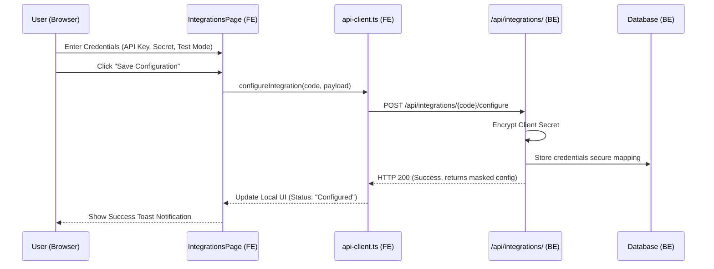
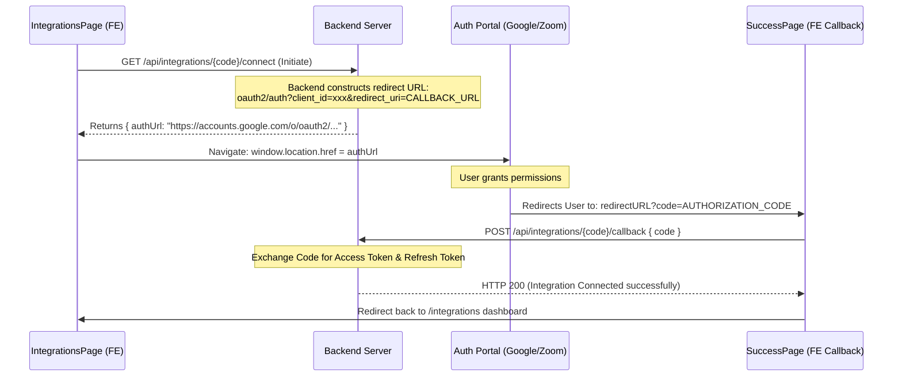

# Integration Connection & OAuth Architecture Guide

This document describes how credentials (API Keys, Secrets) and OAuth redirect flows (Google, Zoom) are synchronized between the Frontend dashboard and the Backend services.

---

## 🔑 1. API Keys & Secrets Configuration Flow
When configuring credentials for platforms like **Cashfree Payments**, **Meta Pixel**, or custom platform tokens:



### Code Implementation Example
To save credential configs using our existing service layer:
```typescript
import { configureIntegration } from '@/api/integrations';

const saveCredentials = async (code: string, key: string, secret: string) => {
  try {
    const response = await configureIntegration(code, {
      apiKey: key,
      apiSecret: secret,
      environment: 'PRODUCTION', // or 'SANDBOX'
    });
    // Response contains { connected: true, health: 'healthy', ... }
    return response;
  } catch (err) {
    console.error("Configuration failed:", err);
  }
};
```

---

## 🔄 2. OAuth 2.0 Redirection Flow (Google / Zoom)
OAuth workflows require a handshake where the backend acts as a secure vault for private credentials, and the frontend handles the redirect sequence.

### Step-by-Step Callback Lifecycle



### Callback Router Implementation Example
To listen for the query code parameters on your callback page (`src/pages/google/GoogleSuccessPage.tsx`):

```typescript
import { useEffect } from 'react';
import { useSearchParams, useNavigate } from 'react-router-dom';
import { useToast } from '@/context/ToastContext';

export default function GoogleSuccessPage() {
  const [searchParams] = useSearchParams();
  const navigate = useNavigate();
  const { success, error } = useToast();

  useEffect(() => {
    const code = searchParams.get('code');
    const state = searchParams.get('state');

    if (code) {
      // Exchange code for secure tokens in backend
      fetch('http://100.85.146.60:8080/api/integrations/google/callback', {
        method: 'POST',
        headers: { 'Content-Type': 'application/json' },
        body: JSON.stringify({ code, state }),
      })
      .then(res => {
        if (!res.ok) throw new Error();
        success('Success', 'Google Calendar connected successfully!');
        setTimeout(() => navigate('/integrations'), 1000);
      })
      .catch(() => {
        error('Failed', 'OAuth authorization code exchange failed.');
      });
    }
  }, [searchParams]);

  return <div>Exchanging secure tokens with Google...</div>;
}
```

---

## 🔒 3. Best Practices & Security Guidelines

1. **Never Store Secrets in the Frontend**: 
   * Always proxy your OAuth credentials through your backend server. The Frontend client should **never** directly store, access, or expose your platform's private keys (e.g. `client_secret`).
2. **Double Encryption**:
   * API Secrets submitted via the `configure` endpoint should be transmitted over HTTPS and encrypted at rest in your backend database (using AES-256 or similar).
3. **Authorized Redirect URIs**:
   * Pre-register your frontend callback address (e.g. `http://localhost:5173/google/success` for local, and `https://app.yourdomain.com/google/success` for production) inside your Google Console / Zoom Marketplace Credentials dashboard.
